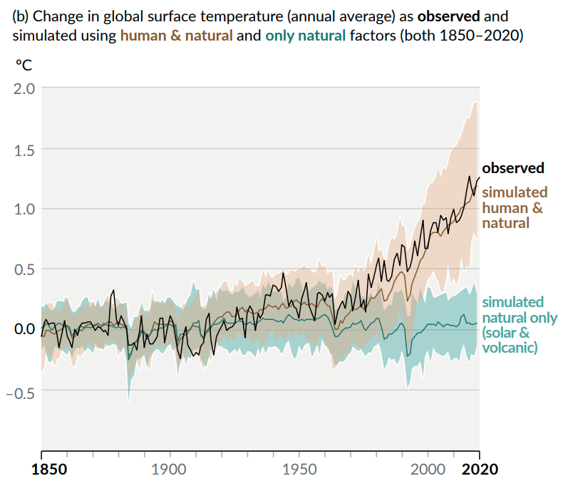
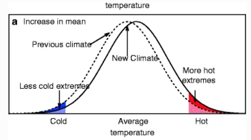
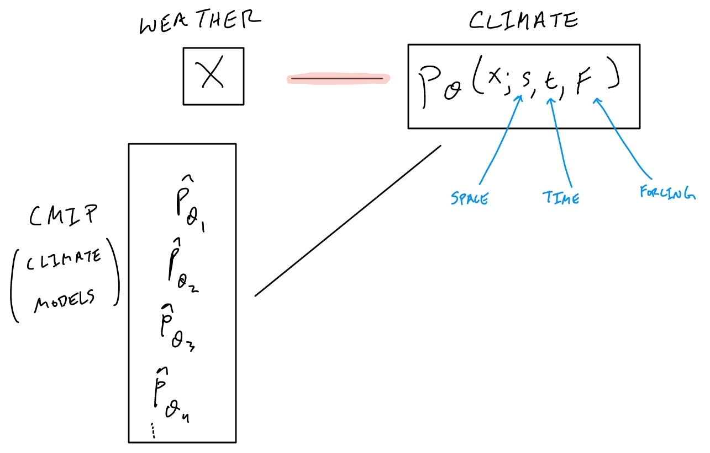
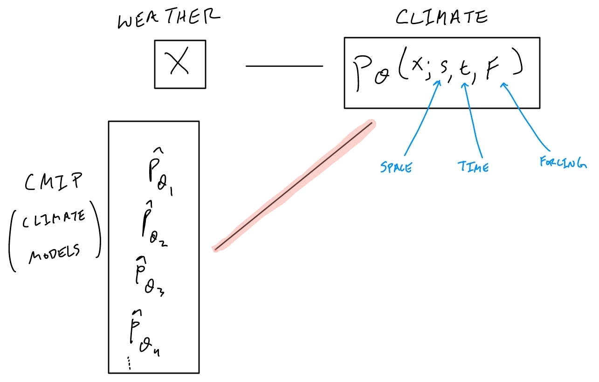
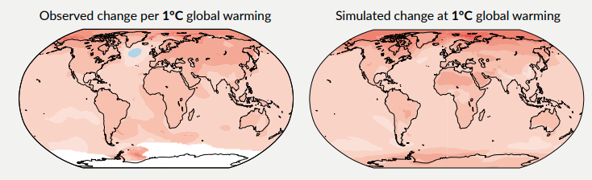
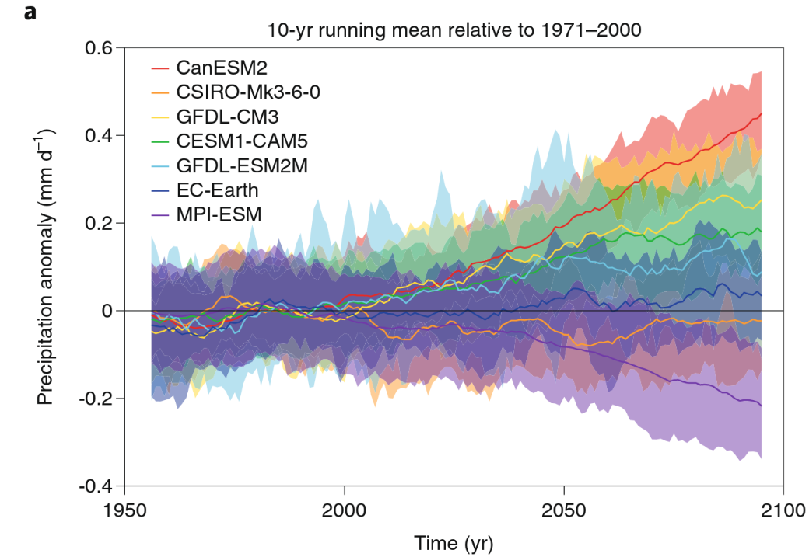
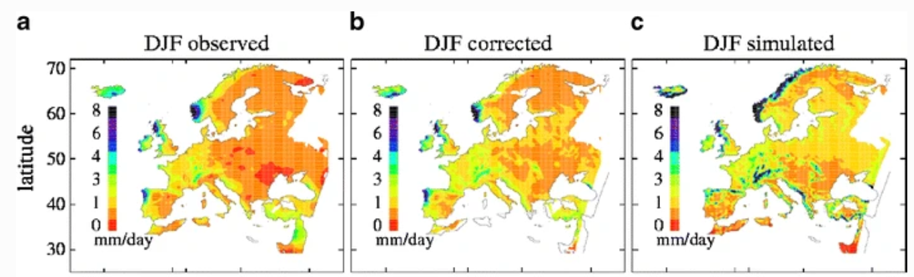
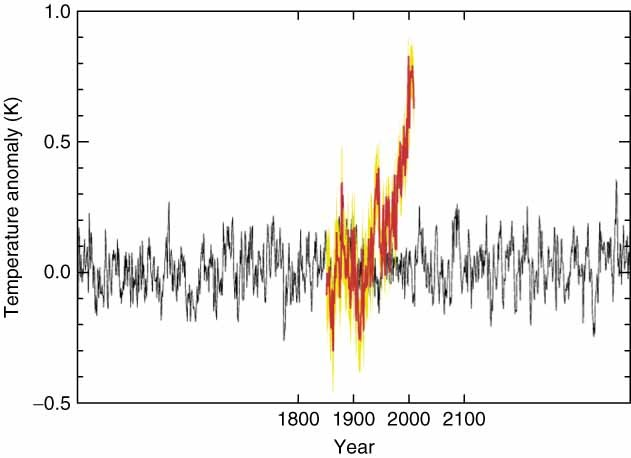
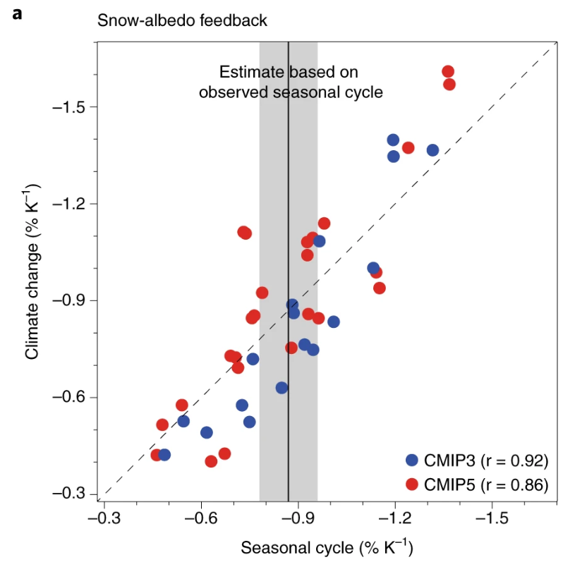
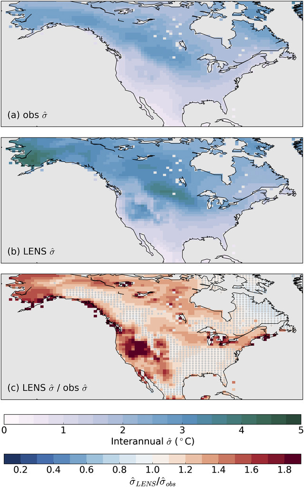

### Context

These slides are a miscellanious collection of notes that I (a statistics grad student) wish I had starting out in climate science.
  
- I think most of this is well understood by climate scientists, but I've never seen it written out in a language that makes sense to me. 
  
- caveats: a lot of this is oversimplified for the sake of clarity

---

### motivation I[^motivation]

{fig-align="center" width=50%}

where does the uncertainty come from, and what does it tell us?

<!-- changes relative to 1850-1900, annually averaged. -->

[^motivation]: IPCC AR6 WG1, SPM Figure 1b

---

### motivation II[^motivation2]

{fig-align="center" width=40%}

Goal: Want the distribution of average daily temperature in LA on April 28, 2023. 

::: {.fragment}

- Approach 1: from observations, compute average temperature every day in the season $\to$ histogram

- Approach 2: from a bunch of different climate model runs, compute average temperature on April 28, 2023 $\to$ histogram

:::

::: {.fragment}

**what's the difference?**

:::

[^motivation2]: Fig 1, Zwiers et al 2013. schematic of daily temperature

---

<!-- ### background -->

<!-- - climate models are driven mostly by our understanding of the earth's physics (different from a statistical model!) -->

<!-- - different groups create different climate models, using different physics -->

<!--   - these climate models take as input initial conditions, and simulate a climate run. -->

<!-- - if a group has enough computing power, they sometimes plug in lots of different initial conditions to get an "initial condition ensemble" -->

<!-- - we can also combine the output from different climate models to create an "multi-model" ensemble -->

<!-- --- -->

### Schematic I: data

{fig-align="center"}

- We observe weather data

- We consider the data to be a *single draw* from some distribution of possible weather, $p_\theta(x ; s, t, F)$  (where $\theta$ is shorthand for model physics/parametrizations)
<!-- (where $\theta$ is shorthand for dependence on climate model physics, $s$ represents spatial location, $t$ represents time, and $F$ represents forcings.) -->

  - we call $p_\theta$ climate (but sometimes we refer to climate as just the mean).

:::{.fragment}

- our goal is to understand $p_\theta$
  
  - $p_\theta$ is super complicated, but there are many constraints!

:::

<!-- --- -->

<!-- ### side note on our definition of climate -->

<!-- Climate scientists often define climate as the average weather (rather than the full distribution $p_\theta$) -->

<!-- - global studies are interested typically interested in climate response to forcing -->

<!--   - $p_\theta(F) = \int_s \int_t p_\theta(s,t, F)dtds$ -->

<!-- - extreme value studies are interested in the tails of this distribution -->

---

### Schematic II: climate models

{fig-align="center"}

Each climate modelling center creates a climate model $\hat p_\theta$, which approximates $p_\theta$ by modelling the underlying physics.

<!--   - running the same model with different initial conditions provides different draws from the distribution $\hat p_\theta$. -->

<!-- - common assumption (at least in the early days): draws from each climate model $\hat p_{i, \theta}$ form an iid sample from $p_\theta$ -->

:::{.fragment}

The three sources of uncertainty: 

- structural uncertainty in $\hat \theta$ (including discretization error), 
- forcing uncertainty in $F$, 
- internal variability $Var_\theta(X)$.

:::

---

### what's the point of all the notation?

- mostly an organization tool for me, but maybe useful to:

  - help categorize different directions of climate research
  
  - help make stats assumptions explicit (and figure out how to weaken them)
  
  - help connect new stats methods to climate
  

:::{.fragment}

**Fundamental question**: Given observations $x_{obs}$ and models $\hat p_\theta$, what can we say about climate $p_\theta$?

:::

:::{.fragment}

**Idea:** We can organize climate stats research according to the types of assumptions they make about the relationships between $x_{obs}, \ \hat p_\theta$, and $p_\theta$.

:::

<!-- [for each point, write out how climate models help. focus on climate models as methods testbed] -->

<!-- #### how do climate models assist observation-only analysis? -->

<!-- --- -->

---

### Multi-model ensemble means[^multimodel]

{fig-align="center"}

Idea: The multi-model ensemble mean $\frac{1}{M}\sum_{m=1}^M x_m$ represents our best understanding of the true $E_\theta[X]$ 
<!-- - If each $\hat p_\theta$ represents a sample from   -->

:::{.fragment}

- $m$ indexes over different climate models

- Assumes unbiased-ness: $\hat p_{\theta_m}$'s are centered around the true $p_\theta$

- varying levels of conditioning on $x_{obs}$ 

<!-- - if all of the $\hat p_\theta$'s agree with one another, and if they are plausible under the observations, then $\hat p_\theta$ is close to the true $p_\theta$ (at least in expectation) -->

[^multimodel]: IPCC AR6 WG 1 SPM Figure 5. 
<!-- Left: linear regression of grid-point temp against global surface temp Right: 20-year mean global surface temp change relative to 1850-1900 -->

:::

---

### Multi-model ensemble spread[^mot]

:::: {.columns}

::: {.column width="50%"}
multi-model ensemble spread represents:

- distances of $\hat p_{\theta_m}$'s from one another.
  - physics uncertainty
  - discretization error
  
- internal variability (sometimes)
  
:::  {.fragment}

Ensemble spread does not represent:

- distances from $\hat p_{\theta_m}$'s to $p_\theta$

:::

:::

::: {.column width="50%"}
{fig-align="center"}
:::

::::

[^mot]: IPCC AR6 WG1, SPM Figure 1b

---

### Single-model ensembles[^deser]

*if we average many runs from the same climate model, we can separate climate signal from internal variability* 

:::{.fragment}

{width="40%" fig-align="center"}

- Running the same model with different initial conditions gives multiple draws from $\hat p_\theta$.
- The mean climate of a single-model ensemble gives the climate signal, given physics $\hat \theta$
<!-- - Multi-model comparison of single-model ensembles quantifies differences in climate signal between different $\hat \theta$. -->

:::

<!-- . . .  -->

<!-- Ideal case: If every climate model had large initial condition ensembles (not computationally feasible) -->
<!-- - we would have good representations of each $\hat p_\theta$, -->
<!-- - we could therefore compare each $\hat p_\theta$ to one another (aka represent physics uncertainty) -->
<!-- - we could also look at the likelihood of the weather under each of these $\hat p_\theta$'s. -->

[^deser]: Fig2a, Deser et al 2020. 10 year running mean, over upper colorado river basin

---

<!-- ## Different ensemble types (at least, theoretically) -->

<!-- Ideal case: If every climate model had large initial condition ensembles (not computationally feasible) -->
<!-- - we would have good representations of each $\hat p_\theta$, -->
<!-- - we could therefore compare each $\hat p_\theta$ to one another (aka represent physics uncertainty) -->
<!-- - we could also look at the likelihood of the weather under each of these $\hat p_\theta$'s. -->

### "Systematic Bias" of climate models[^bias]

*oversimplified idea: if our climate models look different from observations, then there's something wrong with our climate model* (aka understand error in $\hat \theta$)

{width="60%" fig-align="center"}

:::{.fragment}

- Why do climate model runs look different from observations?

  - propagation of error in $\hat \theta$
  - internal variability

<!-- - "systematic" if there are multiple independent realizations of the true system that are consistently wrong -->

<!-- - Is it worth trying to match climate models to observations? -->
<!--   - assume either low variability in observations (or a good way to extract clear signal from observations) -->

:::

:::{.fragment}

Example: Quantile mapping assumes stationarity to show "systematic" bias

<!-- - e.g. that $x$ (e.g. daily precip amounts) follows the same distribution every day. -->
<!--   - so that each $x_t$ gives a **new** sample from some shared distribution $F$ -->
<!--     - and that we should be able to compare $F$ to $\tilde F$ from a climate model -->
    
<!-- - e.g. the number of "wet days" should be the same in climate model run vs an observation -->
<!-- - if the number of wet days is consistently higher (e.g. over many years) in a climate model run vs an observation, is there something wrong with the climate model run? (drizzle effect) -->
:::

<!-- ### how we use observations: -->

<!-- End goal: distances from $\hat p_\theta$'s to $p_\theta$. -->

<!-- We want to use observations to inform these improvements.  -->
<!-- - but in order to effectively use these observations, we need to be able to distinguish mean climate "signal" from weather "noise" -->

<!-- Initial condition ensembles give us to estimate internal variability in a climate model -->

<!-- We can use them to help try to estimate internal variability in observations -->
<!-- - (or vis versa in the case the observational large ensemble) -->

<!-- Then we can try to extract signal from noise: -->
<!-- - e.g. optimal fingerprinting, dynamical adjustment -->

<!-- (often assume something about the observations, e.g. observations = mean climate signal + uncorrelated noise) -->
<!-- (in the case of dynamical adjustment, assume observations = mean climate signal + atmospheric circulation noise) -->

<!-- ### distances from $\hat p_\theta$'s from one another: -->

<!-- To reduce physics uncertainty, research is done to: -->

<!-- - model more physical processes / better model physical processes -->
<!--   - emergent constraints -->
<!-- - run models at finer grid box sizes / more frequent timesteps -->
<!--   - e.g. downscaling -->
<!-- - better parametrize sub-grid processes -->
<!--   - e.g. Zanna's work -->
<!--   - e.g. history matching for better parametrization -->
  

[^bias]: Piani et al 2009 Fig 2. mean daily precipitation in observations (a), climate model output before (c) and after (b) correction

---

### detection and attribution[^1]

<!-- *oversimplified idea: "control" runs from climate models give us simulations of natural variability in the climate system. If observations look really different from control runs, it gives evidence of climate change.  -->

*oversimplified idea: We can add forcings into our climate model one by one to see how each forcing contributes to observed trends* (aka understand $p_\theta(x|F)$)

:::{.fragment}

:::: {.columns}

::: {.column width="50%"}
- assume $y = \sum_{i=1}^p \beta_i x_i + \epsilon$

  - $x_i$ are "fingerprints", 
  - $y$ are observed changes

::: {.fragment} 

- climate model evaluation is trickier with separated forcings
  - assumes climate signal is additive
  - roughly: $p_\theta(y^{obs}_t - y_{t-k}^{obs} | F) = \hat p_\theta (y_t^m - y_{t-k}^{m} | F)$

:::
<!-- - assumes temporal structure of climate models matches temporal structure of observations (i.e. no lag in how forcings impacts). also assumes forcings are well modelled. -->

<!-- - $x^{obs}_t|F - x_{t-k}^{obs} | F = x_t^m|F - x^m_{t-k}|F$ -->

:::

<!-- once we have an estimate of the climate signal from observations, we can use it to: -->

<!-- - compare likelihood of the data with respect to the different climate models $\hat p_\theta$ -->
<!--   - e.g. weighted ensemble means for constraining climate model projections -->

<!-- - correct "bias" in climate models -->

::: {.column width="50%"}

{width="100%" fig-align="right"}

:::

::::

[^1]: Fig 1, Stott et al 2010. global mean temperature change. Black line shows control simulation

:::

---

### Emergent constraints[^ec]

<!-- (Williamson and Sansom 2019) -->

*oversimplified idea: if two things are related in all climate models, then they should also be related in observations* (aka understand $p_\theta$($Y|X$))

:::{.fragment}

:::: {.columns}

::: {.column width="50%"}

- $y_i = x_i^T \beta + \epsilon_i$ where $i$ indexes over ensemble members
- clear signal in $\beta$ suggests $y_{obs} = x_{obs}^T \beta + \epsilon$

:::{.fragment}

- Assumes $\hat p_\theta(y|x) = p_\theta(y|x)$
- requires a good model for $\hat p_\theta(y|x)$ from ensemble

:::
<!-- - typically assume $y_i | x_i$ are i.i.d samples from $p_\theta$ -->
<!--   - i.i.d is a simplification (ensemble dependence from different $\hat p_\theta$) -->
<!--   - samples from $p_\theta$ is a simplification (missing physics) -->

<!-- - beyond this, also assumes linearity in the structure of $y_i | x_i$ -->

<!-- - when applying this to observations and updating projections, assumes that observations contain sufficient signal -->

:::

::: {.column width="50%"}

{width="90%" fig-align="right"}
:::
::::    

[^ec]: Fig 2a from Hall et al 2019. EC on snow-albedo feedbacks. percent albedo change per unit warming, under climate change (y-axis) and current seasonal cycle (x-axis) in climate models

:::

---

### Climate models and traditional geostatistics

Traditional methods try to learn things about $p_\theta$ using observations alone:

- EOFs to understand spatio-temporal patterns of variability

- regressions to determine observational trends

- extreme value models

- stats for extending the observational record spatially (e.g. GPs) and temporally (e.g. paleoclimate)  

- stats for improving the quality of the observational record (e.g. combining data sources)

:::{.fragment}

**Idea:** climate models can be used as a methodological testbed for these methods

- a single climate model run is analagous to observations, 
- and can be validated against other climate models

:::

---

### Example: The observational large ensemble[^obsle]

:::: {.columns}

::: {.column width="50%"}

1. Spread across initial condition ensemble provides $\widehat Var_{\hat \theta}(X)$ (here, $X$ is a temperature trend)

:::  {.fragment}

2. Make structural assumption about $p_\theta$ to obtain "multiple samples" of $x_{obs}$ (block bootstrap)
<!-- 2. Assume that $p_\theta(s,t,F)$ has lots of structure in time (after detrending), i.e. -->
<!-- $p_\theta(s, t, F) \approx p_\theta(s,t + k, F)$ for some time lag $k$. (aka stationarity) -->

:::

:::  {.fragment}

3. Spread across these new "samples" provides $\widehat Var_{\theta}(X)$ 

:::

:::  {.fragment}

ObsLE: Add noise (with variance $\widehat Var_\theta(X)$) to $E_{\hat \theta}[X]$ 

:::
:::

::: {.column width="10%"}

:::

::: {.column width="40%"}

{width="125%"}
:::
::::

[^obsle]: Fig 1, McKinnon et al 2017. internal variability of detrended DJF temperature

---

### References

